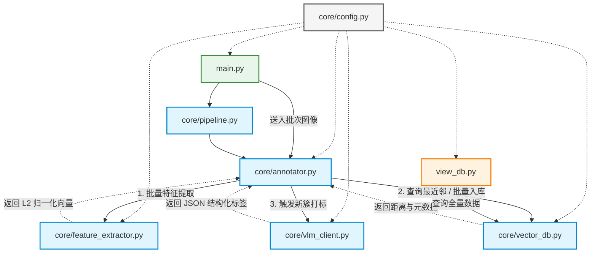

# Auto Tag

本系统旨在处理数百万量级的图像数据，基于 `ChromaDB` + `CLIP` + `VLM` 组合实现图像的动态去重、自动聚类与高维语义标注。


## 核心功能与架构特性

* **批处理加速：** 在 GPU 上以批处理形式运行 CLIP 特征提取。
* **双阈值无监督聚类：**
  * `d ≤ τ_dup` (极度相似): 判定为视频冗余相邻帧，丢弃或软链接，不占用额外特征数据库开销。
  * `τ_dup < d ≤ τ_cls` (语义相似/同场景): 放入同一簇，继承簇中心的语义标签，节省大量 VLM 接口开销。
  * `d > τ_cls` (全新场景): 触发 VLM 打标，建立新簇。
* **增量式持久化：** 数据向量和 Json 标签通过 ChromaDB 持久化，支持随开随用，无缝增量处理新的批次。
* **接口容灾：** 调用 VLM 时具备 Json Schema 强校验和 Exponential Backoff 机制，避免限流导致崩溃。


## 安装与配置

### 环境依赖

在**仓库根目录**使用 [uv](https://docs.astral.sh/uv/) 安装依赖（见 `pyproject.toml` / `uv.lock`）：

```bash
bash scripts/linux/setup_uv_env.sh
# 或：uv sync --extra web
```

系统依赖于 `PyTorch` 运行 CLIP，建议您的系统具备可用的 CUDA 环境以获得最佳性能。

### 配置环境变量

系统使用大模型获取真实自然语言的场景标签。

建议直接使用 api 调用远端模型。请在 `auto_tag` 目录下找到或创建 `.env` 文件，并填入您的模型配置：

```env
# 推荐使用具备原生视觉能力的 VLM，比如 Gemini 2.x 3.x 系列或者 GLM x.xV 系列等
VLM_MODEL_NAME=gemini/gemini-2.5-flash
VLM_API_KEY=your_api_key_here
```
我们通过 `litellm` 代理请求，`VLM_MODEL_NAME` 支持任何被 LiteLLM 兼容的模型格式。对于智谱系列等 LiteLLM 原生不支持的模型，你可以通过下面的方式“曲线救国”一下。

```
# 以 GLM-4.6V 为例
VLM_MODEL_NAME=openai/GLM-4.6V
VLM_API_KEY=your_api_key_heren
# Note: For Zhipu via litellm using the openai format, you might also need to export OPENAI_API_BASE
OPENAI_API_BASE=https://open.bigmodel.cn/api/paas/....
```

如果你本地硬件“足够硬”，也可以直接使用调用本地模型进行推理。此时请将`.env` 文件改为：

```
VLM_MODEL_NAME=None
VLM_API_KEY=None
```

此时默认使用 `GLM-4.6V-Flash` （https://huggingface.co/zai-org/GLM-4.6V-Flash）进行推理。

### 系统参数配置

您可以在 `config.json` 中直接调整系统聚类的敏感度和批次大小：
* `batch_size`: (默认 `32`) 特征提取批量大小。根据您的显存大小增减。
* `tau_dup`: (默认 `0.05`) 去重余弦距离阈值。值越小要求两张图越雷同。
* `tau_cls`: (默认 `0.15`) 聚类余弦距离阈值。
* `embedding_subdir`: 使用 **`--work_dir`** 时，索引落在 `work_dir/<embedding_subdir>`（默认 `embedding_index`）。若目录下仍存在旧版 **`chroma_data`** 且新子目录尚未创建，会自动继续使用 `chroma_data`，避免破坏已有数据。
* `duplicate_links_filename`: Stage1 近重复侧车文件名，默认 `duplicate_links.sqlite`（亦可为 `.jsonl`）。

```json
{
    "batch_size": 32,
    "tau_dup": 0.05,
    "tau_cls": 0.15,
    "embedding_subdir": "embedding_index",
    "duplicate_links_filename": "duplicate_links.sqlite"
}
```


## 快速开始

### 运行全流程处理

使用入口脚本 `main.py` 即可开始对配置的目录下的图像进行扫描、聚类和自动打标：

```bash
bash scripts/linux/setup_uv_env.sh   # 首次：uv 创建 .venv 并安装依赖
source .venv/bin/activate
cd [仓库根目录]
export PYTHONPATH=$PWD:$PYTHONPATH

# 基本运行：日志写入 work_dir/log，向量索引写入 work_dir/<embedding_subdir>（见 config.json）
python -m auto_tag.main --input_dir /path/to/images --work_dir ./work

# 跑多个目录
python -m auto_tag.main --input_dir ./dir1 --input_dir ./dir2 --work_dir ./work
```

### 高级用法与工程特性

#### 1. 人工确认机制 (Manual Verification)
为了确保在处理海量数据前读取配置（如旋转、YUV 转换）正确，系统默认会执行采样确认：
* 系统会从每个输入源提取第一张图并保存至 `log_dir` 下的 `verify_xxx.png`。
* 程序会暂停并等待用户输入 `Y` 确认后才继续。
* 使用 `--b_skip_image_manually_verified` 可跳过此交互过程。

#### 2. 图像旋转 (Rotation)
支持在特征提取前对图像进行旋转，参数值参考 OpenCV 命名：
```bash
# 支持: ROTATE_90_CLOCKWISE, ROTATE_180, ROTATE_90_COUNTERCLOCKWISE
python -m auto_tag.main --input_dir ./data --rotate_angle ROTATE_90_CLOCKWISE
```

#### 3. YUV 原始格式读取
支持直接处理 YUV 裸数据（常见于嵌入式或原始视频流抽帧）：
```bash
# 需要指定 YUV 类型及分辨率
python -m auto_tag.main --input_dir ./yuv_data \
    --b_yuv_image \
    --yuv_type nv21 \
    --image_height 1080 \
    --image_width 1920
```
*   `yuv_type` 支持: `nv21`, `nv12`, `yuv420p`。

#### 4. 失败重试 (Retry Mechanism)
处理失败（读取损坏、网络异常等）的图片路径会自动保存至 `log_dir/failed_images.json`。
您可以通过 `--image_ls_file` 参数直接加载该列表进行重试：
```bash
python -m auto_tag.main --image_ls_file ./work/log/failed_images.json --work_dir ./work_retry
```

### 查看标签与聚类结果

程序运行完毕后，图片特征和打好的标签将固化在向量索引目录中（见 `work_dir/{embedding_subdir}` 子目录）。

您可以使用查看器工具打印出当前已入库的所有图片及其结构化 Json 标签：

```bash
# 查看数据库中的记录和生成的 json 标签
python -m auto_tag.view_db
# 将结果以json文件形式导出
python -m auto_tag.view_db --output_path xxxxx
```

典型的标签输出示例：
```json
{
  "cluster_id": "cls_f37aa179",
  "image_path": "/path/to/test.bmp",
  "is_cluster_center": true,
  "labels_Json": "{\"scene\": \"An indoor event...\", \"objects\": [\"man\", \"glasses\"], \"time_of_day\": \"unknown\", \"actions\": [\"smiling\"]}"
}
```


## Web 控制台与 HTTP API（v2 前端）

FastAPI（`auto_tag/backend`）与 React 前端（`auto_tag/web/`）分进程，经 HTTP 通信。v2 前端使用 **Vite + Tailwind v4 + React 19 + react-router-dom v7**，开发服务器端口 **5020**，通过 Vite proxy 代理 `/api` 到后端 **8000**。

启动可参考 `scripts/linux/run_web_backend.sh`、`scripts/linux/run_web_frontend_v2.sh`（Windows 见 `scripts/windows/`）。

> 旧版 Streamlit 前端保留在 `auto_tag/frontend_streamlit/`，由 `run_web_frontend.sh` 启动（端口 8501）。

### React 页面概要

侧栏顺序：**任务** → **数据库** → **图片查询** → **设置**；点击顶部 **Auto Tag** 进入首页（教程 + 系统信息）。访问地址：**http://localhost:5020**。

* **首页**：可折叠使用教程；服务状态（`GET /api/health`）、**重启后端**（从磁盘重载 `config.json`，会中断进行中任务）。
* **标注任务**：创建/提交/监控标注流水线；任务表单、YUV/旋转/跳过库中已有路径、目录校验、队列与进度轮询；页内 **「查询」** 章节浏览全部历史（默认折叠）、清除历史显示。
* **图片查询**：先查向量索引，再查侧车；侧车命中时附带 **`anchor_embedding_records`**。支持标签编辑（`image_only` / `with_cluster`）、预览与 YUV 解码。
* **数据库**：统计与 config 快照差异比对；重算关系 / 完全重建 / 更新标注；多种导出（默认 `limit` **200000**）。「更新」区内 JSON 详情默认折叠。
* **设置**：`vlm_models`（含 **`id`** 端点标识）、熔断器、Questions 在线编辑；保存后可重启后端生效。

### REST 要点

| 能力 | 方法 | 路径 |
|------|------|------|
| 创建任务（含 `skip_if_in_db`） | POST | `/api/jobs` |
| 任务列表（所有历史任务 + 服务启动时间） | GET | `/api/jobs` |
| 任务状态（`total`、`processed`、`failed_so_far`、`skip_in_db`、`vlm_calls`、`stage1_skips`、`stage2_joins`、`created_at`） | GET | `/api/jobs/{job_id}` |
| 任务日志 | GET | `/api/jobs/{job_id}/logs` |
| 按路径查记录 | GET | `/api/records/by_path?image_path=...&work_dir=...` |
| 预览 PNG | GET | `/api/records/preview?image_path=...` |
| 更新 labels | POST | `/api/records/update_labels`（`with_cluster`：该图所在簇全部文档；`image_only`：仅该路径文档，**若无记录**则 CLIP 插入新条目，body 可带 `image_width`/`image_height`/`yuv_type`/`b_yuv_image` 等解码参数） |
| 冗余列表 | GET | `/api/duplicates`（默认读 `work_dir/log/duplicate_links.sqlite`） |
| 数据库统计与配置差异 | GET | `/api/database/stats?work_dir=...&config_path=...`（`config_path` 与设置页 config 一致时可比对未重启进程下的修改） |
| 仅导出索引记录 | GET | `/api/database/export_embeddings`（`mode=range` / `cluster` / `chunk`，单条 `limit`/`chunk_size` 最大 200000） |
| 仅导出侧车 | GET | `/api/database/export_duplicates`（`mode=range` / `chunk`） |
| 紧凑导出（共享字典） | GET | `/api/database/export_compact_shared` |
| 紧凑导出（平行字段切片） | GET | `/api/database/export_compact_slice?offset=&limit=` |
| 紧凑导出（平行字段分块） | GET | `/api/database/export_compact_chunk?chunk_index=&chunk_size=` |
| 仅重算关系（复用向量与 labels，按当前 τ 重算簇） | POST | `/api/database/recompute_relations`（与 `/api/jobs` 互斥） |
| 完全重建索引（快照 `input_dirs` 全量重跑流水线） | POST | `/api/database/rebuild_relations`（与 `/api/jobs` 互斥） |
| 更新标注（VLM 全量或增量） | POST | `/api/database/reannotate`（body：`full_refresh` / `incremental` 二选一，`centers_only` 可选） |

### 构建快照与侧车路径

* 任务**成功结束**后会在 `work_dir/log/` 写入 **`auto_tag_db_build_snapshot.json`**，记录本次构建所用的 `tau_dup`、`tau_cls`、`questions`、模型名、**`input_dirs` / `image_ls_files`** 及 YUV/旋转等流水线参数，供 `/api/database/stats`、**「仅重算关系 / 完全重建」** 与 Streamlit「数据库」页比对。
* 推断 **`log` 目录** 时，使用 **「向量索引目录的父目录下的 `log/`」**，与具体子目录名（`embedding_index` 或旧版 `chroma_data`）无关。
* **`log/path_prefix_registry.json`**：登记输入根目录前缀 ID；Chroma 与侧车可存 **`path_prefix_id` + `image_rel_path`**，减少重复绝对路径字符串（无匹配前缀时 id 为 `0`，相对段为整路径）。

### 索引元数据扩展

新写入记录优先使用 **`path_prefix_id` + `image_rel_path`**；查询与 HTTP API 仍会解析为绝对路径。旧数据仅含 **`image_path`** 时仍可查询。另写入 **`media_kind`**（`rgb`/`yuv`）、**`pix_w`**、**`pix_h`**、**`yuv_layout`**，便于预览与 YUV 解码。

### 紧凑标注导出（CLI）

```bash
export PYTHONPATH=$PWD:$PYTHONPATH
# 完整一份 JSON
python -m auto_tag.export_compact_labels --work_dir ./work --out ./compact_full.json
# 仅共享字典 / 切片 / 分块（与 HTTP 接口语义一致）
python -m auto_tag.export_compact_labels --work_dir ./work --shared_only --out ./compact_shared.json
python -m auto_tag.export_compact_labels --work_dir ./work --slice_offset 0 --slice_limit 10000 --out ./compact_slice.json
python -m auto_tag.export_compact_labels --work_dir ./work --chunk_index 0 --chunk_size 50000 --out ./compact_c0.json
```


## 目录结构说明

### 模块协作关系



### 文件功能详述

**根目录（入口与文档）**

* `main.py`：CLI 入口，调用 `core.pipeline`。
* `view_db.py`：查看 / 导出 Chroma 元数据。
* `config.json`、`.env`：与 `core/config.py` 配合加载参数。

**`core/`（算法与 IO 核心）**

* `core/config.py`：Pydantic 配置（读取上级目录的 `config.json`、`.env`）。
* `core/feature_extractor.py`：CLIP 批量特征与 L2 归一化。
* `core/vlm_client.py`：VLM 调用与 Prompt。
* `core/vector_db.py`：向量库访问（当前实现为 ChromaDB，cosine）。
* `core/annotator.py`：双阈值聚类与入库调度。
* `core/pipeline.py`：路径收集、样图校验、批处理（CLI 与 `backend` 共用）。
* `core/duplicate_store.py`：Stage 1 冗余侧车（默认 SQLite，可选 JSONL）。
* `core/utils/load_image.py`：普通图 / YUV / 旋转 / `load_image_for_job`。
* `backend/`：FastAPI 服务（`uvicorn auto_tag.backend.app:app`），与 Streamlit 分进程、HTTP 对接。
* `frontend_streamlit/`：Streamlit 控制台（`streamlit run auto_tag/frontend_streamlit/app.py`）。Web 依赖见仓库根目录 `pyproject.toml` 的 `[project.optional-dependencies.web]`。
* `scripts/linux/`、`scripts/windows/`：uv 检测/安装、环境配置与 Web/试跑启动脚本。
