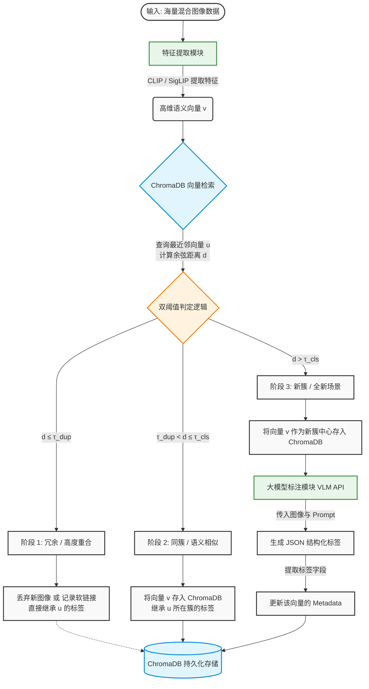

# 自动图像标注系统工程实施方案 (基于 ChromaDB + CLIP + VLM)

## 1. 系统概述与核心目标

本系统旨在处理数百万量级的混合图像数据（包含大量无序的视频抽帧及普通照片），在**零本地模型训练**的前提下，实现图像的动态去重、自动聚类与高维语义标注。

**核心工作流：**

1. **特征提取：** 图像输入后，由轻量级开源视觉基础模型提取高维语义向量。
2. **动态去重与聚类：** 利用 ChromaDB 进行向量近似最近邻检索（ANN）。基于距离阈值判断该图像是冗余帧（直接抛弃或合并）、属于已知簇（继承标签），还是全新场景（创建新簇）。
3. **大模型标注：** 当触发全新场景时，调用 VLM（如 GPT-4o, Claude 3.5, Qwen-VL 等）对该簇的中心图像进行结构化理解与标注。
4. **持久化与扩容：** 所有特征向量与元数据持久化至 ChromaDB，系统支持随时中断与无缝增量扩容。

## 2. 系统工作流程图

以下流程图展示了从图像输入到标签入库的完整处理链路，以及各模块之间的判定关系：



## 3. 技术栈选型

- **特征提取小模型 (Feature Extractor)：** 推荐使用 **OpenAI CLIP (`ViT-B/32`)** 或 **Google SigLIP**。
  - *原因：* 开源、无需微调、原生支持生成高度浓缩的语义级特征向量（512 维或 768 维），推理速度快（支持极高并发的 Batch 处理）。
- **向量数据库 (Vector Database)：** **ChromaDB**。
  - *配置：* 采用 `PersistentClient` 模式落盘存储。距离度量标准必须配置为 `cosine`（余弦相似度）。
- **视觉大模型 (VLM)：** 任意支持图片输入和 JSON 格式化输出的 API 模型。

## 4. 核心算法：双阈值增量聚类逻辑

由于视频抽帧缺乏时间戳或文件名标识，我们完全依赖特征向量在空间中的距离来判定图像关系。设定两个余弦距离阈值： $\tau_{dup}$ （去重阈值）与 $\tau_{cls}$ （聚类阈值），且 $0 < \tau_{dup} < \tau_{cls} < 1$ 。

对于任意新输入图像的特征向量 $v$ ，在 ChromaDB 中查询与其最相似的 Top-1 向量 $u$ ，其余弦距离为 $d(v, u)$ ：

1. **冗余/高度重合阶段 (** $d(v, u) \le \tau_{dup}$ **):**
   - **物理意义：** 极大概率是同一视频的相邻帧，或完全一样的图片。
   - **操作：** 丢弃新图像（不入库以节省 ChromaDB 内存），或仅将其文件路径追加到向量 $u$ 的元数据 (Metadata) 中，**直接继承** $u$ 的标签。
2. **同簇/语义相似阶段 (** $\tau_{dup} < d(v, u) \le \tau_{cls}$ **):**
   - **物理意义：** 属于同一个场景或具有高度相似的语义，但不完全雷同。
   - **操作：** 将 $v$ 存入 ChromaDB，并在 Metadata 中标记其属于 $u$ 所在的 Cluster ID。**继承**该 Cluster 的标签。
3. **新簇/全新场景阶段 (** $d(v, u) > \tau_{cls}$ **):**
   - **物理意义：** 遇到了图库中从未出现过的全新场景或物体。
   - **操作：** 将 $v$ 作为**新的 Cluster Center** 存入 ChromaDB。触发 VLM API 对该图像进行打标，将返回的 JSON 标签写入该向量的 Metadata 中。

*(注：经验阈值参考* $\tau_{dup} = 0.05$ *(即相似度 0.95)，* $\tau_{cls} = 0.15$ *(即相似度 0.85)，具体需根据 CLIP 模型版本在少量数据上微调。)*

## 5. ChromaDB 数据模式设计 (Schema)

在 ChromaDB 中，我们将维护一个 Collection。关键的元数据 (Metadata) 设计如下：

```
{
  "image_path": "/data/images/img_001023.jpg",
  "is_cluster_center": true,  // 是否为簇中心（触发过 VLM 标注的图）
  "cluster_id": "cls_98f2a1", // 所属的簇 ID
  "labels_json": "{\"scene\": \"street\", \"objects\": [\"car\"]}" // VLM 返回的序列化标签
}
```

## 6. 核心工程代码参考 (Python)

以下为指导工程师开发的伪代码骨架，展示了系统的核心控制流：

```
import chromadb
import torch
import uuid
import json
from PIL import Image
from transformers import CLIPProcessor, CLIPModel

class ImageAutoAnnotator:
    def __init__(self, db_path="./chroma_data"):
        # 1. 初始化模型
        self.device = "cuda" if torch.cuda.is_available() else "cpu"
        self.model = CLIPModel.from_pretrained("openai/clip-vit-base-patch32").to(self.device)
        self.processor = CLIPProcessor.from_pretrained("openai/clip-vit-base-patch32")
        
        # 2. 初始化 ChromaDB (持久化模式)
        self.chroma_client = chromadb.PersistentClient(path=db_path)
        self.collection = self.chroma_client.get_or_create_collection(
            name="image_embeddings",
            metadata={"hnsw:space": "cosine"} # 强制使用余弦距离
        )
        
        # 3. 设定阈值 (余弦距离：越小越相似)
        self.TAU_DUP = 0.05  # 去重阈值
        self.TAU_CLS = 0.15  # 聚类阈值

    def extract_feature(self, image_path: str) -> list:
        """提取归一化后的图像特征向量"""
        image = Image.open(image_path).convert("RGB")
        inputs = self.processor(images=image, return_tensors="pt").to(self.device)
        with torch.no_grad():
            features = self.model.get_image_features(**inputs)
            # 必须进行 L2 归一化，以便计算余弦相似度
            features = features / features.norm(p=2, dim=-1, keepdim=True) 
        return features.cpu().numpy()[0].tolist()

    def call_vlm_for_annotation(self, image_path: str) -> str:
        """调用 VLM 进行打标 (需工程师实现具体 API 调用)"""
        # TODO: 构造 Prompt 并请求 VLM (如 GPT-4o)
        # 强制要求输出 JSON 字符串
        mock_response = '{"scene": "unknown", "objects": ["tree", "sky"]}'
        return mock_response

    def process_image(self, image_path: str):
        """处理单张图像的核心流"""
        vector = self.extract_feature(image_path)
        
        # 如果库为空，直接作为第一个簇中心插入
        if self.collection.count() == 0:
            self._create_new_cluster(image_path, vector)
            return

        # 查询最相似的 1 个向量
        results = self.collection.query(
            query_embeddings=[vector],
            n_results=1,
            include=["distances", "metadatas"]
        )
        
        min_distance = results['distances'][0][0]
        nearest_meta = results['metadatas'][0][0]

        if min_distance <= self.TAU_DUP:
            # [阶段 1] 冗余抽帧：极度相似，直接忽略或记录软链接
            print(f"[{image_path}] 冗余图像，跳过入库 (距离: {min_distance:.3f})")
            
        elif min_distance <= self.TAU_CLS:
            # [阶段 2] 同一簇：相似场景，存入向量并继承标签，不调 VLM
            cluster_id = nearest_meta['cluster_id']
            labels = nearest_meta.get('labels_json', '{}')
            self._insert_to_db(image_path, vector, cluster_id, False, labels)
            print(f"[{image_path}] 归入现有簇 {cluster_id} (距离: {min_distance:.3f})")
            
        else:
            # [阶段 3] 新场景：距离远，创建新簇并调用 VLM
            print(f"[{image_path}] 发现新场景，触发 VLM (距离: {min_distance:.3f})")
            self._create_new_cluster(image_path, vector)

    def _create_new_cluster(self, image_path: str, vector: list):
        """创建新簇并调用 VLM"""
        cluster_id = f"cls_{uuid.uuid4().hex[:8]}"
        labels_json = self.call_vlm_for_annotation(image_path)
        self._insert_to_db(image_path, vector, cluster_id, True, labels_json)

    def _insert_to_db(self, image_path: str, vector: list, cluster_id: str, is_center: bool, labels: str):
        """向 ChromaDB 插入记录"""
        doc_id = str(uuid.uuid4())
        self.collection.add(
            ids=[doc_id],
            embeddings=[vector],
            metadatas=[{
                "image_path": image_path,
                "cluster_id": cluster_id,
                "is_cluster_center": is_center,
                "labels_json": labels
            }]
        )

# 批量运行入口示例
if __name__ == "__main__":
    annotator = ImageAutoAnnotator()
    image_list = ["img1.jpg", "img2.jpg", "img3.jpg"] # 替换为真实路径列表
    for img in image_list:
        try:
            annotator.process_image(img)
        except Exception as e:
            print(f"处理 {img} 失败: {e}")
```

## 7. 工程化与性能优化建议 (重点关注)

1. **提取阶段的 Batch Processing (批处理):**

   - **瓶颈提示：** 示例代码是逐张图片提取特征的，这在 GPU 上利用率极低。
   - **改进要求：** 工程师在实现 DataLoader 时，必须使用 Batch 模式（如 `batch_size=128` 或 `256`）进行 `model.get_image_features()` 前向传播。

2. **ChromaDB 内存管理与异步检索：**

   - **瓶颈提示：** ChromaDB 在处理数百万数据时，内存消耗巨大。在循环内部逐条 `query` 和 `add` 会导致 I/O 阻塞。
   - **改进要求：** 将特征提取器作为独立的服务（或进程）产生向量流。利用 ChromaDB 的批量接口 `collection.query(query_embeddings=[v1, v2, ...])` 进行批量检索，在内存中完成双阈值判定后，再批量 `collection.add()` 入库。

3. **VLM 并发控制与重试机制：**

   - 当处理新数据集初期，会频繁触发“新簇”逻辑，导致大量调用 VLM API。必须实现 **Token 速率限制 (Rate Limiting)**、**指数退避重试 (Exponential Backoff)** 以及异常捕获，防止 API 被阻断或账单失控。

4. **VLM 的 Prompt 设计最佳实践：**

   建议工程师配置系统级 Prompt 时，要求 VLM 输出严格的 JSON Schema。如果使用的是支持 Tools/Function Calling 的模型（如 OpenAI 接口），建议直接定义 Function Schema 强制其返回结构化字段（如 `scene`, `time_of_day`, `entities`, `actions` 等），以保证后续标签解析的 100% 成功率。

