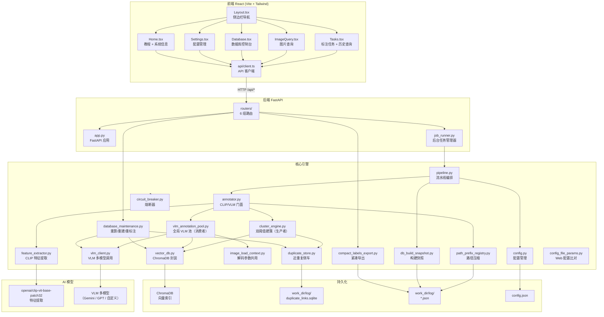
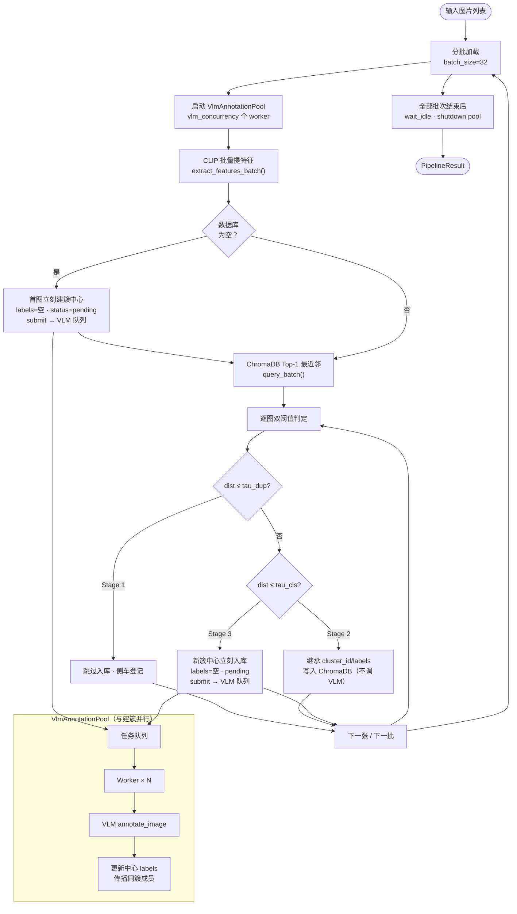
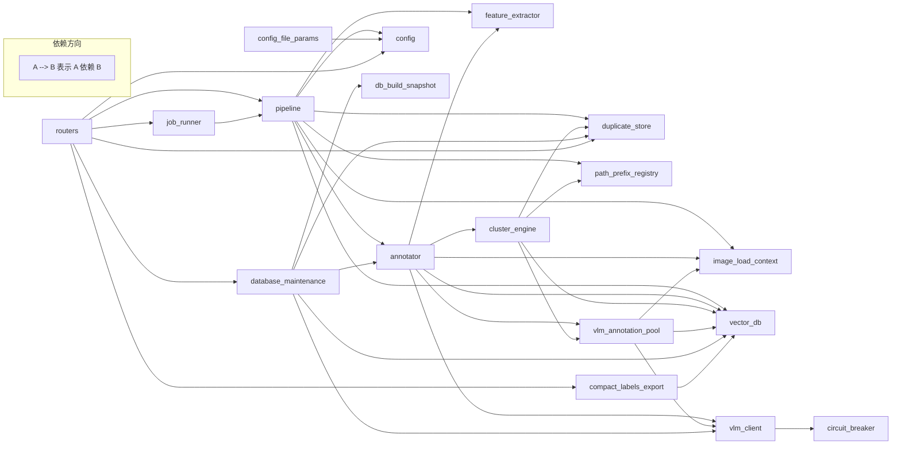
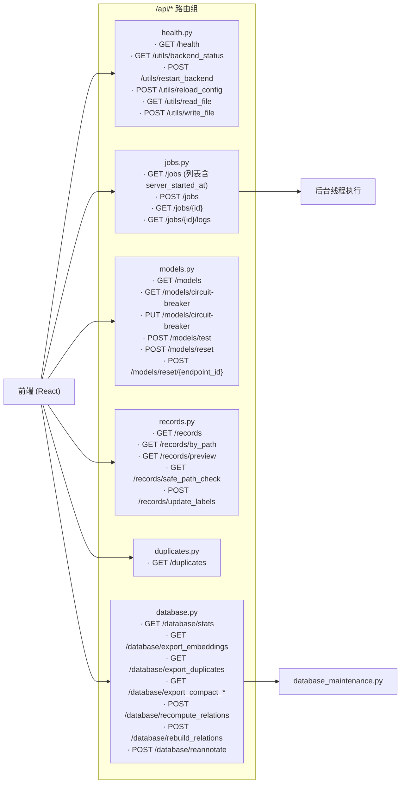
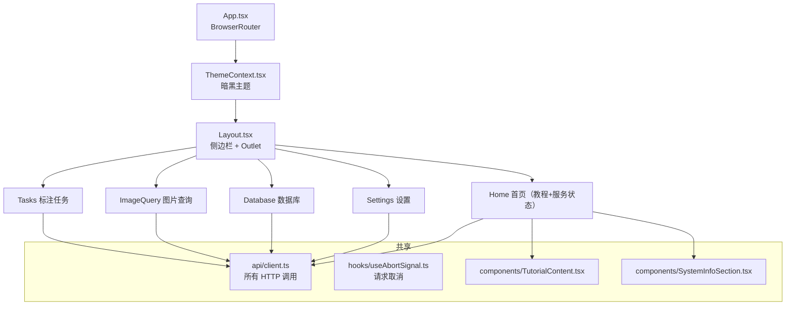
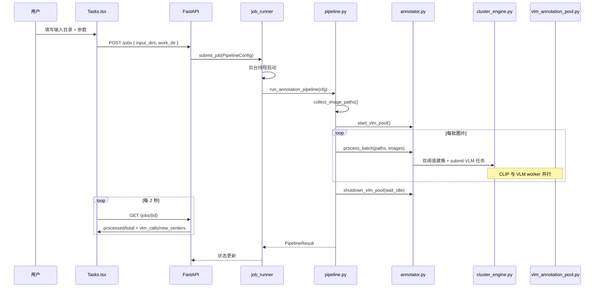
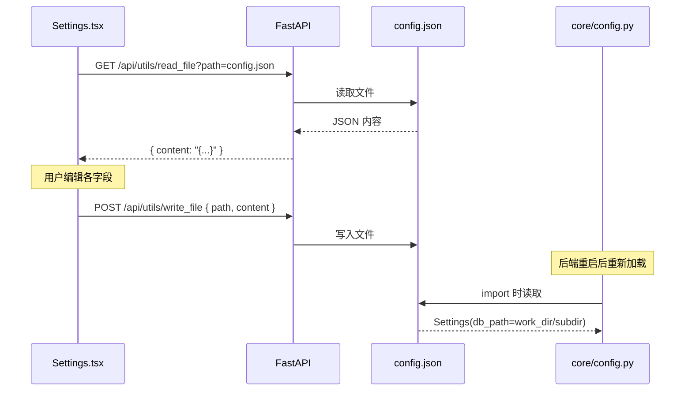

# 技术架构

> 涵盖模块依赖、API 路由、前端组件、核心算法、数据流向。

---

## 1. 系统总览



---

## 2. 核心算法：双阈值建簇 + 异步 VLM 标注

CLIP 建簇与 VLM 打标已**解耦**为生产者–消费者模型：`ClusterEngine` 只写向量与簇关系，新簇中心以空 `labels_json` 入库并异步入队；`VlmAnnotationPool` 在全局 worker 池中并行打标并回写中心、传播成员标签。



### 进度 API 字段（Web 双进度条）

| 字段 | 含义 |
|------|------|
| `processed` / `total` | **建簇阶段**：已完成双阈值判定的图片数 |
| `new_centers` | 已入队的待 VLM 标注簇中心数 |
| `vlm_calls` | 已完成 VLM 标注的簇中心数 |
| `stage1_skips` | Stage 1 近重复跳过 |
| `stage2_joins` | Stage 2 并入已有簇 |

建簇与 VLM 可**重叠**：`processed < total` 时 VLM 可能已在跑；`processed == total` 且 `vlm_calls < new_centers` 时为 VLM 收尾阶段。

**批内可见性**：同一 batch 内 Chroma 只查一次，故 `ClusterEngine` 维护本批内存索引——近重复（Stage1）对任意已处理向量比距；聚类（Stage2/3）仅对本批**簇中心**比距，避免 Stage2 成员误拉低距离。

### 阈值含义

| 参数 | 默认值 | 含义 |
|---|---|---|
| `tau_dup` | 0.05 | **近重复阈值**。cosine 距离 ≤ tau_dup 判定为重复/冗余帧，不入库 |
| `tau_cls` | 0.25 | **聚类阈值**。tau_dup < dist ≤ tau_cls 判定为同簇成员，继承簇标签 |
| `dist > tau_cls` | — | **新簇阈值**。立刻创建簇中心（labels 待标），异步入 VLM 队列 |

---

## 3. 模块依赖关系



---

## 4. API 路由总览



### 路由与前端页面对照

| 页面 | 用到的 API 端点 |
|---|---|
| **Home** | `GET /health`, `GET /utils/backend_status`, `POST /utils/restart_backend` |
| **Tasks** | `POST /jobs`, `GET /jobs/{id}`, `GET /jobs/{id}/logs`, `GET /jobs` |
| **ImageQuery** | `GET /records/by_path`, `GET /records/preview`, `POST /records/update_labels` |
| **Database** | `GET /database/stats`, `GET /database/export_*`, `POST /database/recompute_relations`, `POST /database/rebuild_relations`, `POST /database/reannotate`, `GET /records`, `GET /duplicates` |
| **Settings** | `GET /utils/read_file`, `POST /utils/write_file`, `GET /models`, `PUT /models/circuit-breaker`, `POST /models/test`, `POST /models/reset` |

---

## 5. 前端组件树



---

## 6. 数据流向

### 6.1 标注任务执行



### 6.2 配置管理



---

## 7. 配置项一览

```mermaid
mindmap
  ((config.json))
    基础参数
      batch_size: 32
      tau_dup: 0.05
      tau_cls: 0.25
      record_stage1_duplicates: true
    工作目录
      work_dir: "./test_work_dir"
      embedding_subdir: "embedding_index"
      duplicate_links_filename: "duplicate_links.sqlite"
    VLM 模型
      [vlm_models]
        id: "uuid（endpoint_id）"
        name: "model-name"
        base_url: "https://..."
        api_key: "sk-..."
        priority: 1
        enabled: true
      vlm_strategy: "priority / round_robin"
    熔断器
      time_window_seconds: 300
      failure_rate_threshold: 0.5
      cooldown_seconds: 600
    Questions
      scene: { description, type }
      time_of_day: { description, type, choices }
      num_of_person: { description, type, min }
      brightness: { description, type, min, max, step }
```

---

## 8. 各层职责边界

| 层级 | 目录 | 职责 |
|---|---|---|
| **核心引擎** | `core/` | 与 HTTP 无关的业务逻辑。CLIP 提取、ChromaDB 操作、VLM 调用、流水线编排。可被 CLI 和 HTTP 共用。 |
| **后端 API** | `backend/` | FastAPI 路由层。参数校验、后台任务管理、请求响应转换。调用 core 层完成业务。 |
| **前端** | `web/` | React SPA。用户交互、API 调用、状态展示。不包含业务逻辑。 |
| **CLI** | `main.py`、`view_db.py` | 命令行入口。适合调试、批量处理、无头服务器使用。 |

### 关键设计决策

1. **work_dir 统一由后端 config 管理**：前端 Settings 页写入 `config.json`，后端各路由不传 work_dir 时自动回退到 `settings.db_path`（详见 `_resolve_paths` 和 `_resolve_work_dir`）。
2. **API 无状态**：后端不维护全局 work_dir 状态；每个请求或者从参数获取，或者回退到 import-time 的 `Settings` 单例。
3. **后台任务互斥**：`job_runner.py` 用 `threading.Lock` 保证单线程执行，避免 ChromaDB 并发写入冲突。
4. **路径压缩**：`PathPrefixRegistry` 将磁盘绝对路径映射为 `(prefix_id, rel_path)`，减小 ChromaDB 存储开销。