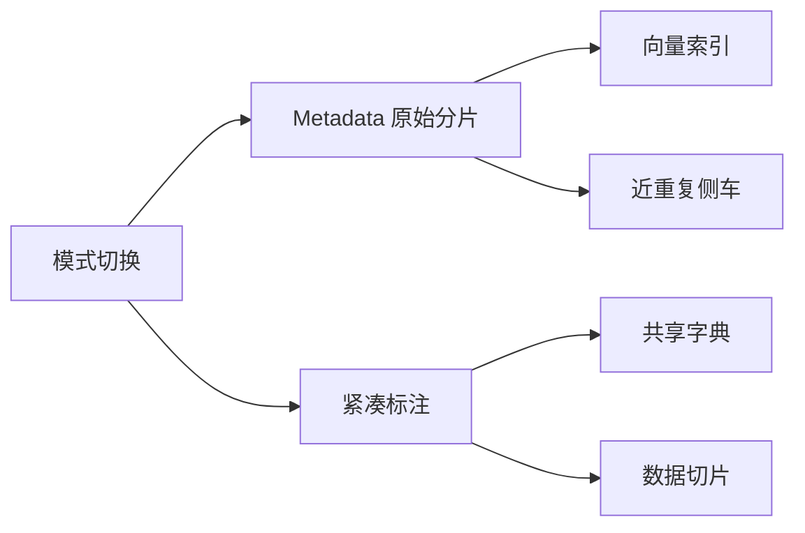
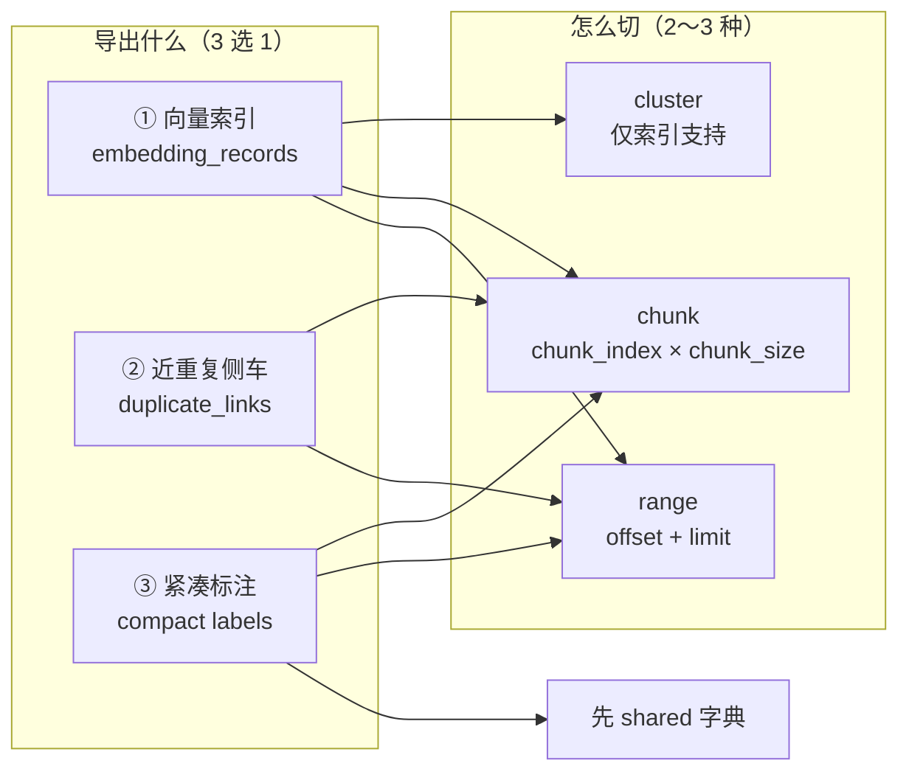
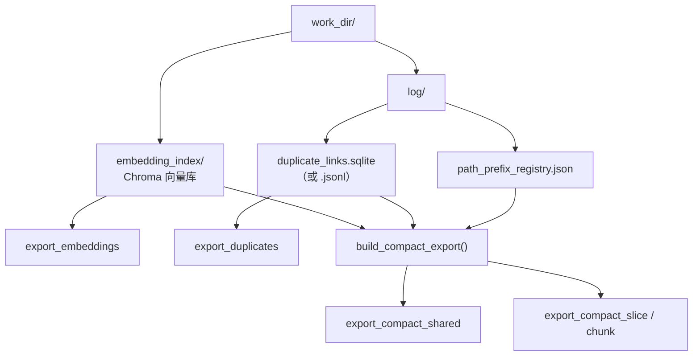
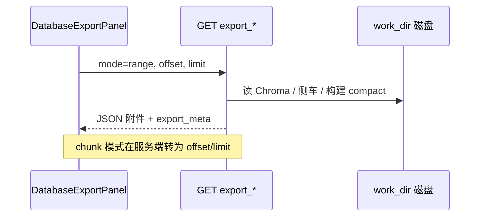
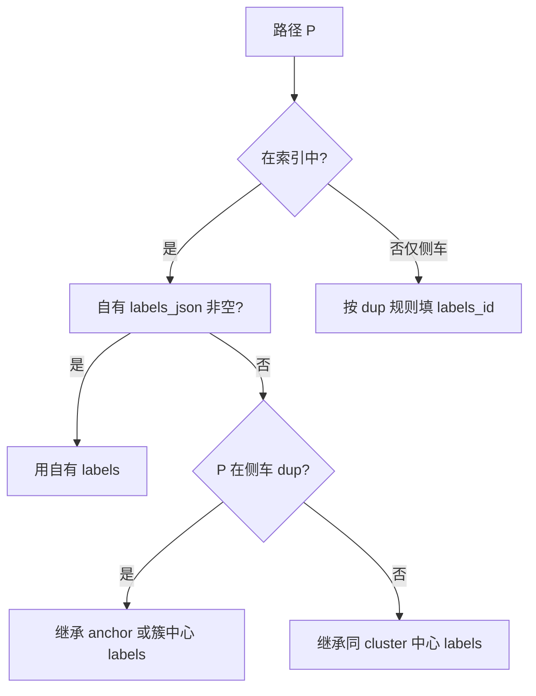
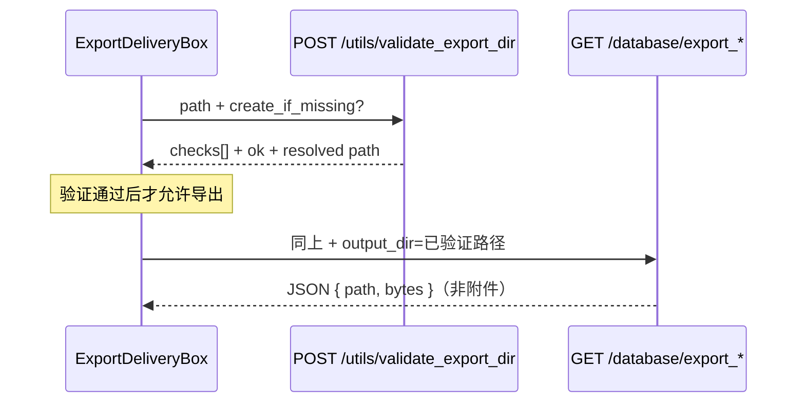
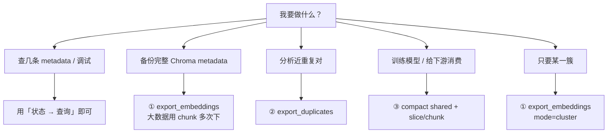

# 数据库页「导出」区域逻辑说明

> 对应前端：`auto_tag/web/src/components/DatabaseExportPanel.tsx`（由 `Database.tsx` 第三章引用）  
> 对应后端：`GET /api/database/export_embeddings` / `export_duplicates` / `export_compact_*`  
> 核心实现：`auto_tag/backend/routers/database.py`、`auto_tag/core/compact_labels_export.py`

---

## 1. 两种导出模式（页面切换）

数据库页「导出」章节通过 **模式切换** 呈现，避免一次展示全部按钮：



| 模式 | 两个 Box | 含义 |
|------|----------|------|
| **Metadata 原始分片** | 向量索引 + 近重复侧车 | 磁盘上两块存储的分别导出；**合起来**才覆盖流水线处理过的全部图片 |
| **紧凑标注** | 共享字典 + 数据切片 | 由索引+侧车现场拼装的合并视图；先字典、后切片 |

旧版曾将上述四个 Box 与三种分页方式平铺在同一屏，易与「三类无关导出」混淆；改版后先选模式，再在该模式下操作两个 Box。

---

## 2. 为什么容易觉得「乱」？（历史问题）

旧版 UI 把 **9 个按钮**平铺在三行小标题下（索引 / 侧车 / 标注），存在这些问题：

| 问题 | 表现 |
|------|------|
| **三类数据源混在一起** | 「索引」「侧车」「紧凑标注」是三种不同产物，但按钮样式相同，难以区分用途 |
| **分页方式重复命名** | 多处都叫「按 offset/limit」「分块下载」，不知道各自对应哪个 API |
| **参数不可见** | 实际固定 `offset=0`、`limit=200000`、`chunk_index=0`，用户无法改页码 |
| **「标注」名不副实** | 第三组不是原始 `labels_json`，而是 **紧凑训练格式**（平行数组 + 字典） |
| **紧凑导出两步关系未说明** | 「共享字典」与 slice/chunk 的依赖关系没有提示 |

**理顺后的心智模型**只有两个维度：



---

## 3. 在页面中的位置

数据库页自上而下：

| 章节 | 作用 |
|------|------|
| **状态** | 统计卡片 + 只读查询（records / 侧车预览） |
| **更新** | 维护索引（重建 / 重算 / 重标） |
| **导出（本文档）** | 把磁盘数据 **下载为 JSON 文件**（只读，不修改库） |

导出与「状态」里的查询不同：

- **查询**：在页面内展示 JSON，适合抽查
- **导出**：浏览器下载附件，适合备份、离线分析、下游训练

`work_dir` 由设置页 config 统一指定，导出 API 默认从后端 `settings` 推导路径（与数据库页其他章节一致）。

---

## 4. 三类数据源对照



| 类别 | 磁盘来源 | API | 典型用途 |
|------|----------|-----|----------|
| **① 向量索引** | `{work_dir}/{embedding_subdir}` Chroma collection | `GET /database/export_embeddings` | 审计 metadata、迁移、调试 cluster_id / labels_json |
| **② 近重复侧车** | `{work_dir}/log/{duplicate_links_filename}` | `GET /database/export_duplicates` | 导出 Stage1 登记的 dup↔anchor 对 |
| **③ 紧凑标注** | 由索引 + 侧车 + 路径注册表 **现场拼装** | `GET /database/export_compact_*` | 训练集：路径压缩 + labels 字典化 + 有效标签推导 |

---

## 5. 分页模式：range / chunk / cluster

所有导出单次 **limit / chunk_size 上限为 200 000**（`_EXPORT_MAX`，前后端一致）。

### 4.1 range（offset + limit）

```
第 1 次：offset=0,       limit=200000  → 行 0 … 199999
第 2 次：offset=200000,  limit=200000  → 行 200000 …
```

- 适用于：**向量索引**、**侧车**、**紧凑 slice**
- 响应 `export_meta` 中含 `offset`、`limit`、`record_count` / `row_count`

### 4.2 chunk（chunk_index + chunk_size）

等价于：

```
offset = chunk_index × chunk_size
limit  = chunk_size
```

- 适用于：**向量索引**、**侧车**、**紧凑 chunk**
- 语义与 range 相同，只是参数换了一种写法，方便「第 N 块」心智

### 4.3 cluster（仅向量索引）

```
mode=cluster & cluster_id=<簇 ID>
```

- 一次导出该 `cluster_id` 下全部 Chroma 文档（上限 100 000 条/请求，见 `_gather_embedding_items`）
- **侧车与紧凑导出不支持**按 cluster 切



---

## 6. 各 API 响应结构

### 5.1 `export_embeddings`

```json
{
  "export_meta": {
    "resource": "embedding_records",
    "mode": "range",
    "offset": 0,
    "limit": 200000,
    "record_count": 1234,
    "work_dir": "...",
    "log_dir": "..."
  },
  "embedding_records": [
    { "id": "...", "metadata": { "cluster_id": "...", "labels_json": "...", ... } }
  ]
}
```

每条为 Chroma `id` + **完整 metadata**（含 `labels_json` 字符串、`is_cluster_center`、路径前缀 id 等）。

### 5.2 `export_duplicates`

```json
{
  "export_meta": {
    "resource": "duplicate_links",
    "duplicate_total": 5000,
    "row_count": 200000,
    "note": "本文件共 … 条，侧车总计约 … 条，可继续增大 offset 或下一 chunk。"
  },
  "duplicate_links": [ { "dup_path": "...", "anchor_path": "...", "ts": "..." } ]
}
```

若总数大于本页，meta 中带 `note` 提示继续翻页。

### 5.3 紧凑标注（两步）

紧凑格式把 **N 张图** 存成 **4 个等长数组** + **共享字典**，减小 JSON 体积。

**Step A — `export_compact_shared`（必须先下或只需字典时）**

```json
{
  "export_meta": { "shared_export": true, "row_count": 10000, ... },
  "labels": { "0": { "scene": "..." }, "1": { ... } },
  "prefix": { "0": "/data/images/", "1": "/other/" },
  "cluster": { "0": "cluster-uuid-1", ... },
  "cluster_to_labels": { "0": 5 }
}
```

| 字段 | 含义 |
|------|------|
| `labels` | labels_id → 标注对象 |
| `prefix` | prefix_id → 绝对路径前缀 |
| `cluster` | cluster_id 整数 → 簇 UUID 字符串 |
| `cluster_to_labels` | 簇 → 该簇中心 labels_id（有则填） |

**Step B — `export_compact_slice` 或 `export_compact_chunk`**

```json
{
  "export_meta": { "slice_offset": 0, "slice_limit": 200000, "total_rows": 10000, ... },
  "images": ["subdir/a.jpg", ...],
  "labels_id": [3, 3, 5, ...],
  "prefix_id": [0, 0, 1, ...],
  "cluster_id": [2, 2, 4, ...]
}
```

绝对路径 = `prefix[prefix_id] + images[i]`（实现见 `PathPrefixRegistry`）。

**有效标签推导**（`build_compact_export`）对每张图：



因此紧凑导出 **不是** 简单 dump `labels_json`，而是与流水线一致的「有效标签」视图。

---

## 7. 前端组件结构（改版后）

`DatabaseExportPanel.tsx` 自上而下：

1. **`ExportDeliveryBox`** — 下载方式（独立 Box）
2. **模式切换** — Metadata | 紧凑标注
3. **两个导出 Box**（随模式变化）

### 7.1 下载方式 Box

| 方式 | 行为 |
|------|------|
| **浏览器下载** | 默认；`Content-Disposition` 附件，由浏览器保存 |
| **保存到本机目录** | 各导出 API 增加 `output_dir`；后端写入 **FastAPI 进程所在机器** 的路径 |

本机目录模式流程：



校验项（`export_path_utils.py`）：路径解析 → 存在且为目录（可创建）→ `W_OK` → 探针写入删除。

### 7.2 导出内容区

| 模式 | Box A | Box B |
|------|-------|-------|
| Metadata | 向量索引（range / cluster / chunk） | 近重复侧车（range / chunk） |
| 紧凑标注 | 共享字典（一键下载） | 数据切片（slice / chunk） |

高级分页参数收在各自 Box 的 `<details>` 内；主按钮为「快速导出」。

---

## 8. 选型指南：我该下哪一种？



| 场景 | 推荐 |
|------|------|
| 数据量 < 20 万 | 各卡片「快速导出」一次即可 |
| 数据量 > 20 万 | 用 chunk：`chunk_index=0,1,2…` 直到 `record_count` < chunk_size |
| 训练管道 | 先 `export_compact_shared`，再按需 `export_compact_chunk`；合并时共享字典只保留一份 |
| 与 Chroma 原样一致 | 用 `export_embeddings`，不要用 compact |
| 只要 dup 关系、不要向量 | 用 `export_duplicates`，不要 embeddings |

---

## 9. 与「状态 → 查询」的区别

| | 状态 · 查询 records | 导出 · 向量索引 |
|--|----------------------|-----------------|
| API | `GET /api/records` | `GET /api/database/export_embeddings` |
| 路径解析 | 后端会做 path 解析展示 | 原始 metadata |
| 输出 | 页面内 JSON | 浏览器下载文件 |
| 侧车 | 单独「加载近重复侧车」 | `export_duplicates` 全量/分页下载 |

---

## 10. 实现要点（开发者）

| 项 | 说明 |
|----|------|
| 上限 | `_EXPORT_MAX = 200_000`，`database.py` 与前端 `EXPORT_MAX` 一致 |
| work_dir | Query `work_dir` 可选；默认 `_resolve_paths(None)` 从 settings 反推 |
| compact 性能 | 每次 slice/chunk 都会 `build_compact_export()` 全量扫索引+侧车；超大库注意耗时 |
| 附件名 | `Content-Disposition: attachment`，如 `auto_tag_embeddings_range.json` |
| 互斥 | 导出为同步 GET，**不占用** `job_runner` 维护锁 |

---

## 11. 相关文件索引

| 文件 | 职责 |
|------|------|
| `web/src/components/DatabaseExportPanel.tsx` | 导出 UI |
| `web/src/pages/Database.tsx` | 第三章容器 |
| `web/src/api/client.ts` | `exportEmbeddings` / `exportDuplicates` / `exportCompact*` |
| `backend/routers/database.py` | 路由与 `_gather_embedding_items` |
| `core/compact_labels_export.py` | `build_compact_export`、`shared_compact_dict`、slice/chunk |

---

## 12. 改版记录

| 日期 | 变更 |
|------|------|
| 2026-07 | 新增本文档；导出 UI 重构为三卡片 + 可配置分页参数；澄清「标注」实为紧凑格式 |
| 2026-07 | 导出 UI 改为两种模式切换（Metadata / 紧凑标注），各模式两个 Box |
| 2026-07 | 新增「下载方式」Box：浏览器下载 / 本机目录 + 路径验证与 output_dir 落盘 |
