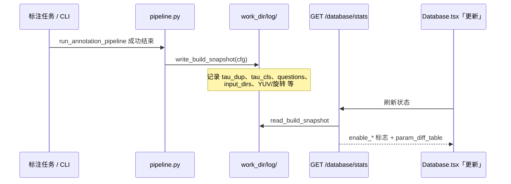
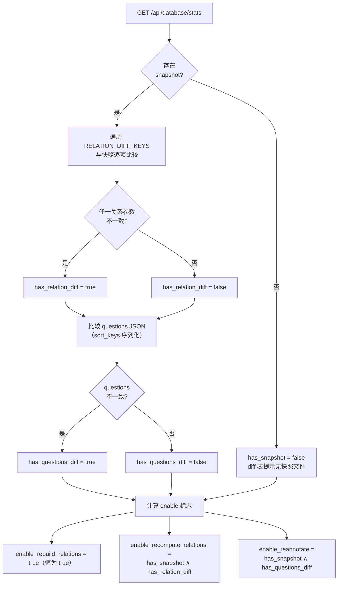
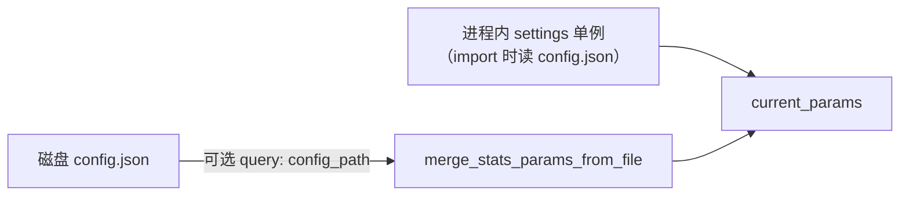
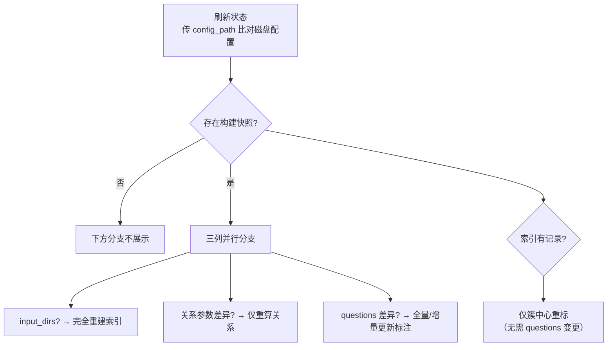
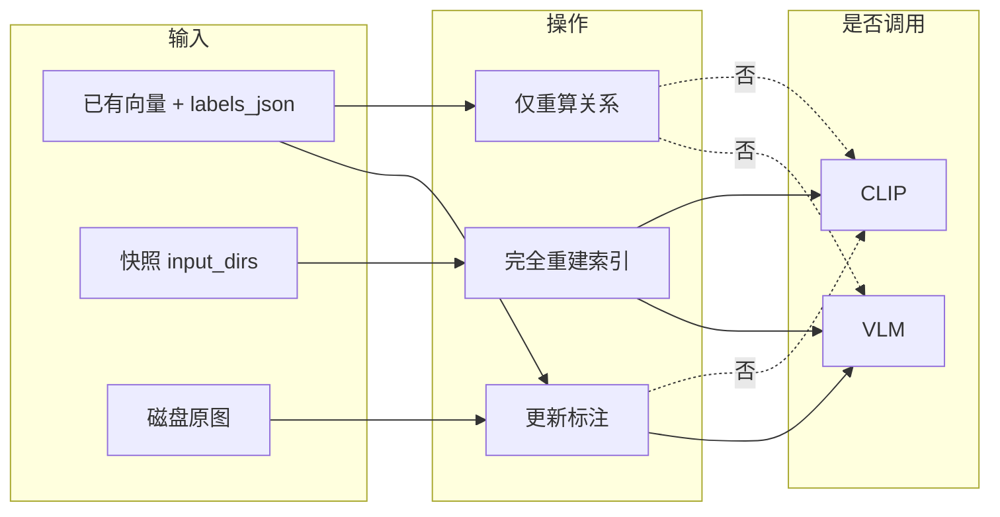
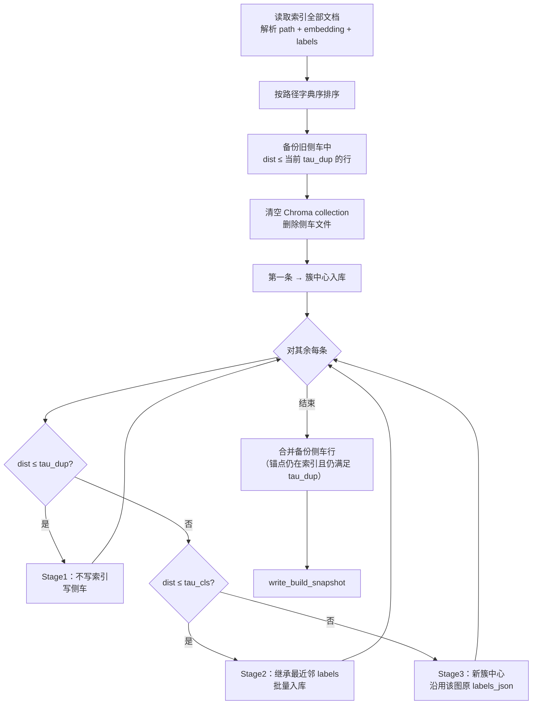
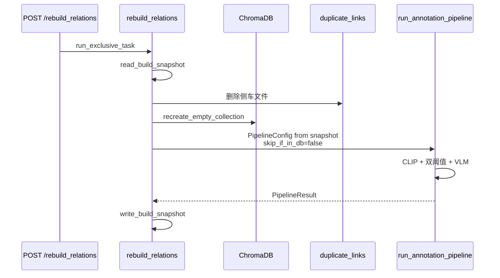
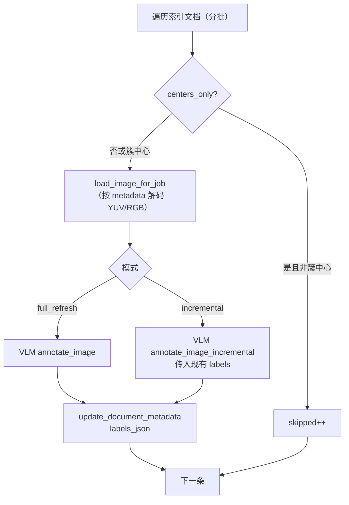
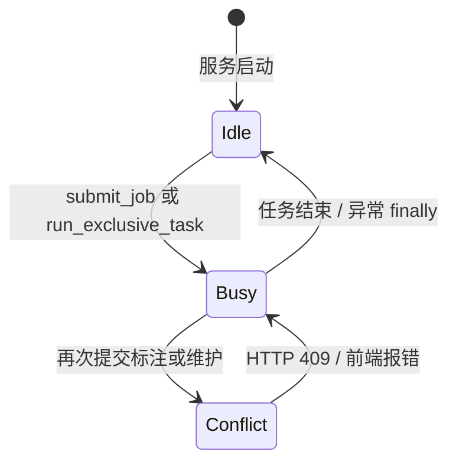
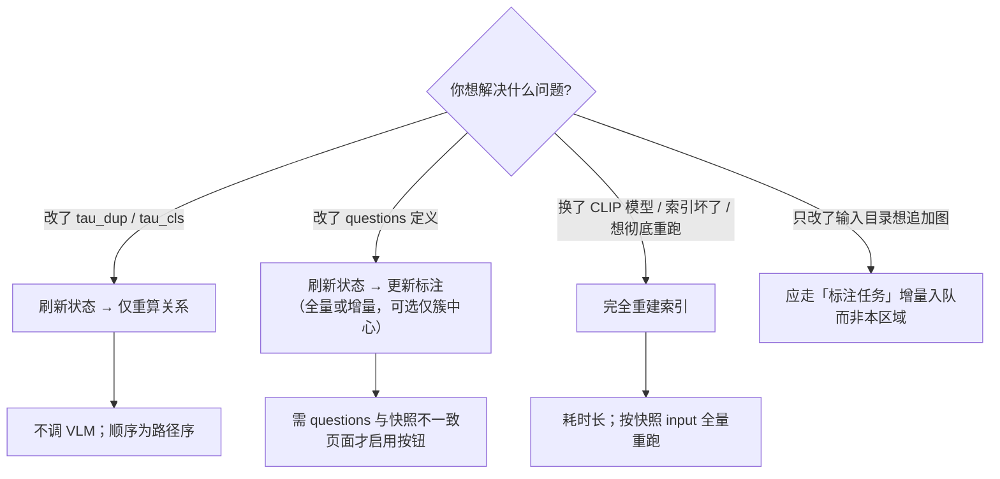

# 数据库页「更新」区域逻辑说明

> 对应前端：`auto_tag/web/src/pages/Database.tsx` 中 **「更新」** section  
> 对应后端：`GET /api/database/stats` + `POST /api/database/recompute_relations` / `rebuild_relations` / `reannotate`  
> 核心实现：`auto_tag/core/database_maintenance.py`

---

## 1. 在页面中的位置

数据库页自上而下大致分为：

| 区域 | 作用 |
|------|------|
| 刷新状态 + 统计卡片 | 展示索引条数、簇数、侧车条数等 |
| 快照 vs 当前配置 | 比对上次成功任务与当前参数 |
| **更新（本文档）** | 三种维护操作：重算关系 / 完全重建 / 更新标注 |
| 查询 | 分页查 records、加载侧车 |
| 导出 | 索引 / 侧车 / 紧凑标注导出 |

「更新」区域不是独立路由，而是数据库控制台里的一组 **互斥后台任务**（与「标注任务」队列共用 `job_runner` 锁）。

---

## 2. 前置依赖：构建快照

所有「是否可点」的判断，都依赖 `work_dir/log/auto_tag_db_build_snapshot.json`。

**快照写入时机**（`db_build_snapshot.py`）：

- 标注任务 **status=done** 后（`job_runner`）
- **仅重算关系** 成功后
- **完全重建索引** 成功后

快照 **不会** 在「更新标注」后单独刷新 questions 字段（labels 原地更新，快照内容不变，除非用户再跑完整流水线或重算/重建）。

---

## 3. 配置比对：谁决定按钮能不能点？

刷新状态时，后端比较 **快照** 与 **当前配置**（`current_params`），算出三个布尔量：

### 3.1 关系类参数（`RELATION_DIFF_KEYS`）

影响 **簇划分 / 侧车**，**不**直接改 VLM 标签内容：

| 键 | 含义 |
|----|------|
| `tau_dup` | 近重复阈值 |
| `tau_cls` | 聚类阈值 |
| `batch_size` | 批大小（写入快照，重算时不重跑 CLIP） |
| `collection_name` | Chroma collection 名 |
| `clip_model_name` | CLIP 模型（变更后应重建索引） |
| `vlm_model_name` | VLM 模型名（写入快照） |
| `duplicate_links_filename` | 侧车文件名 |
| `embedding_subdir` | 索引子目录名 |

任一项与快照不同 → `has_relation_diff = true` → **「仅重算关系」** 可点。

### 3.2 Questions（`has_questions_diff`）

快照中的 `questions` 与当前 `current_params.questions` JSON 不完全相同 → **「更新标注」** 整块可点（含下拉框、「仅簇中心调 VLM」勾选框、提交按钮）。

若页面显示 **「完全一致」**，则 `has_questions_diff = false`，上述控件全部 `disabled`——这是预期行为，不是勾选框故障。

### 3.3 `current_params` 从哪来？

- 默认：`current_params` 来自 **后端启动时** 加载的 `settings`。
- 数据库页刷新时传 **`config_path`**（与 `Settings.tsx` 相同，见 `web/src/constants/config.ts`），用 **磁盘 JSON 覆盖** 比对字段，**无需重启** 即可在流程图中点亮对应分支。
- **维护操作本身**仍读运行时 `settings`；改 config 后若要维护逻辑用新参数，需 **重启后端**（流程图顶部有说明）。

~~当前 `Database.tsx` 调用 `api.databaseStats({})` **未传** `config_path`~~（已实现传参）。

---

## 4. 前端「更新维护流程」与 enable 标志

数据库页使用组件 **`web/src/components/DatabaseUpdateFlow.tsx`**：以流程图组织条件节点（菱形）与操作节点（按钮），条件满足时可点击，否则灰色并显示说明。

| 控件 | `enabled` 条件 | API |
|------|----------------|-----|
| 完全重建索引 | `has_snapshot` 且快照含 `input_dirs` | `POST /api/database/rebuild_relations` |
| 仅重算关系 | `enable_recompute_relations` | `POST /api/database/recompute_relations` |
| 全量/增量 + 执行更新标注 | `enable_reannotate` | `POST /api/database/reannotate` |
| 仅簇中心重标 | `enable_reannotate_centers_only` | `reannotate(centers_only=true, full_refresh=true)` |

刷新状态时，`Database.tsx` 传入与设置页相同的 **`config_path`**（`constants/config.ts`），磁盘 config 与快照比对**无需重启后端**；各禁用节点旁有中文提示（改进项 3）。

**`enable_reannotate_centers_only`**：`has_snapshot ∧ embedding_record_count > 0`，与 `enable_reannotate`（questions 差异）解耦（改进项 2）。

---

## 5. 三种维护操作对比

| 维度 | 仅重算关系 | 完全重建索引 | 更新标注 |
|------|------------|--------------|----------|
| **典型触发** | 改了 `tau_dup` / `tau_cls` | 想从零按原输入重跑 | 改了 `questions` |
| **CLIP** | 否 | 是 | 否 |
| **VLM** | 否 | 是（新簇） | 是（按策略） |
| **复用原向量** | 是 | 否（清空重建） | 是（只改 metadata） |
| **复用原 labels** | 是（Stage2 继承；Stage3 沿用该图旧 labels） | 否（重新打标） | 全量覆盖 / 增量合并 |
| **侧车** | 清空后重算 + 合并合法旧行 | 清空重跑生成 | 不变 |
| **需要快照** | 是 | 是（需 `input_dirs`） | 否（仅需索引目录存在） |
| **前端默认可点** | 仅关系参数有差异时 | 始终 | 仅 questions 有差异时 |

---

## 6. 仅重算关系（`recompute_relations_only`）

**目的**：阈值或关系相关配置变了，但 **不想重新提 CLIP 特征、不想重新调 VLM**，只根据现有向量与已有 `labels_json` 重新走一遍双阈值逻辑。

**注意**：

- 处理顺序为 **路径字典序**，与在线流水线按目录扫描顺序 **可能不同**，簇划分结果可能与首次跑批略有差异。
- `vlm_calls` 恒为 0。
- 若索引为空或路径无法解析，返回 400。

---

## 7. 完全重建索引（`rebuild_relations`）

**目的**：彻底清空后，按快照里的 `input_dirs` / `image_ls_files` 及 YUV/旋转参数，用 **当前运行时 settings** 重新跑完整 `run_annotation_pipeline`（等同重新提交一次标注任务，但输入来源是快照而非表单）。

**注意**：

- 快照 **必须** 含非空 `input_dirs`。
- 会重新调用 VLM（新簇），耗时与费用与全量标注相当。
- 成功后快照被覆盖为本次重建参数。

---

## 8. 更新标注（`reannotate`）

**目的**：`questions` 定义变了，对 **已入库文档** 重新调 VLM 写回 `labels_json`，**不**改变向量与簇成员关系（除非后续再「重算关系」）。

### 8.1 请求参数

| 字段 | 前端对应 | 说明 |
|------|----------|------|
| `full_refresh` | 下拉「全量」 | `vlm.annotate_image`：按当前 questions 整图重标并覆盖 |
| `incremental` | 下拉「增量」 | `annotate_image_incremental`：仅为缺失 key 补标 |
| `centers_only` | 「仅簇中心调 VLM」 | 跳过 `is_cluster_center != true` 的文档 |

全量与增量 **互斥**；`centers_only` 可与任一种组合。

### 8.2 处理流程

**注意**：

- 不读快照；只要索引目录存在即可执行（但前端仍因 `enable_reannotate` 限制而默认不可点）。
- 每条成功调用计一次 `vlm_calls`；失败记入 `errors_sample`。
- 不更新 `auto_tag_db_build_snapshot.json` 中的 `questions` 字段。

---

## 9. 互斥与并发

三类维护操作与 **标注任务** 均通过 `job_runner.run_exclusive_task` 或 `submit_job` 共用 `_busy` 锁，**同一时刻只能跑一个**。

---

## 10. 选型决策树（给产品 / 测试）

---

## 11. 常见疑问

### Q1：为什么「更新标注」点不了，但「仅簇中心重标」可以？

- **更新标注（全量/增量）** 需要 `questions` 与快照不一致（`enable_reannotate`）。
- **仅簇中心重标** 只需有快照且索引非空（`enable_reannotate_centers_only`），用于 questions 未改、仅对簇中心重新调 VLM 的场景。
- 流程图中每个灰色节点下方有具体说明。

### Q2：改了设置页的 config，为什么还显示「完全一致」？

可能原因：

1. 未点「刷新状态」；
2. 实际只改了与 `RELATION_DIFF_KEYS` / `questions` 无关的字段；
3. 磁盘 config 与快照确实一致（流程图会显示「条件未满足」及提示文案）。

### Q3：「仅重算关系」和改阈值后重新跑任务有何区别？

| | 仅重算关系 | 重新跑标注任务 |
|--|------------|----------------|
| 输入来源 | 已在索引中的记录 | 磁盘 `input_dirs` |
| CLIP | 不重算 | 重算 |
| VLM | 不调 | 新簇会调 |
| 适用 | 调阈值、复用向量 | 新图入库、覆盖路径 |

### Q4：完全重建 vs 仅重算，何时用哪个？

- **仅重算**：向量仍有效（同一 CLIP 模型），只调阈值或关系逻辑。
- **完全重建**：CLIP 模型变了、索引逻辑大改、或希望按快照输入 **完整重跑** 流水线。

---

## 12. 相关源码索引

| 路径 | 说明 |
|------|------|
| `web/src/pages/Database.tsx` | 数据库页、刷新 stats（含 `config_path`） |
| `web/src/components/DatabaseUpdateFlow.tsx` | 「更新维护流程」流程图 UI |
| `web/src/constants/config.ts` | 与设置页共用的 config 路径宏 |
| `backend/routers/database.py` | `stats`、`recompute` / `rebuild` / `reannotate` 路由 |
| `core/database_maintenance.py` | 三种维护实现 |
| `core/db_build_snapshot.py` | 快照读写 |
| `core/config_file_params.py` | stats 热比对磁盘 config |
| `backend/job_runner.py` | `run_exclusive_task` 互斥锁 |

---

## 13. 已落地的体验改进（2026-07）

1. ✅ **Database 页传 `config_path`**：保存 config 后刷新即可更新流程图分支状态（执行维护仍要重启后端）。
2. ✅ **`enable_reannotate_centers_only`**：questions 未变时仍可「仅簇中心重标」。
3. ✅ **流程图式「更新维护流程」**：条件节点 + 操作节点 + 禁用说明，替代原横向按钮条。
