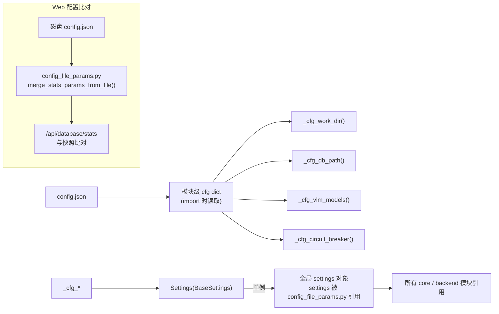

# 功能拓展指南

本文档指导开发者如何安全、高效地拓展 auto_tag 各模块。

---

## 目录

1. [新增 VLM 模型后端](#1-新增-vlm-模型后端)
2. [新增自定义 Question 类型](#2-新增自定义-question-类型)
3. [新增 API 端点](#3-新增-api-端点)
4. [新增前端页面](#4-新增前端页面)
5. [定制标注逻辑（双阈值策略）](#5-定制标注逻辑)
6. [新增存储后端](#6-新增存储后端)
7. [新增 CLI 命令](#7-新增-cli-命令)
8. [修改配置系统](#8-修改配置系统)

---

## 1. 新增 VLM 模型后端

### 涉及文件

| 文件 | 改动 |
|---|---|
| `vlm_client.py` | 新增 API 调用方法 |
| `config.json` | 添加模型配置 |
| (可选) `.env` | 兼容旧版单模型配置 |

### 步骤

**1.1 在 `VLMClient` 中新增 API 调用方法**

```python
# auto_tag/core/vlm_client.py

class VLMClient:
    # 已有 annotate_image() 作为主入口
    # 已有 _call_single_model() 分发到具体后端

    def _call_my_new_model(self, model: dict, image: Image.Image) -> dict:
        """调用新 VLM 后端。"""
        name = model["name"]
        base_url = model.get("base_url") or "https://your-api.example.com/v1/"
        api_key = model.get("api_key")

        # 1. 编码图片
        b64 = encode_pil_image_to_base64(image)

        # 2. 构造请求
        prompt = self._generate_prompt()
        payload = {
            "model": name,
            "messages": [
                {
                    "role": "user",
                    "content": [
                        {"type": "text", "text": prompt},
                        {"type": "image_url", "image_url": {"url": f"data:image/jpeg;base64,{b64}"}},
                    ],
                }
            ],
        }

        # 3. 发送请求
        result = openai_chat_completion(base_url, api_key, payload)

        # 4. 解析响应
        content = _extract_content(result)
        return json.loads(_clean_json(content))
```

**1.2 在 `_call_single_model` 中注册路由**

```python
# vlm_client.py 中已有策略分发逻辑
# 根据 model["name"] 前缀或字段自动选择调用方法
```

**1.3 配置添加**

```json
{
    "vlm_models": [
        {
            "name": "my-new-model",
            "base_url": "https://api.example.com/v1/",
            "api_key": "sk-xxx",
            "priority": 3,
            "enabled": true
        }
    ],
    "vlm_strategy": "priority"
}
```

| 策略 | 行为 |
|---|---|
| `priority` | 按 priority 顺序调用，失败时自动切换到下一个（failover） |
| `round_robin` | 轮询所有 enabled 模型 |

### 熔断器

每个模型自动关联熔断状态。`CircuitBreaker` 记录时间窗口内的失败次数，超阈值后自动停用，`cooldown_seconds` 后恢复。

```python
# 熔断器在 VLMClient 内部自动管理
# 无需额外配置，通过 circuit_breaker 参数注入
```

---

## 2. 新增自定义 Question 类型

### 涉及文件

| 文件 | 改动 |
|---|---|
| `config.json` | 添加 question 定义 |
| `vlm_client.py` | 自动读取 questions，`_generate_prompt()` 构造 JSON schema |
| 前端 `Settings.tsx` | 已有模板/自由形式两种模式，可能需新增 UI 控件 |

### Question 定义格式

```json
{
    "questions": {
        "scene": {
            "description": "description of the overall scene",
            "type": "string"
        },
        "time_of_day": {
            "description": "Determine the shooting time ...",
            "type": "category",
            "choices": ["day", "night", "unknown"]
        },
        "num_of_person": {
            "description": "Number of people in the picture",
            "type": "int",
            "min": 0
        },
        "brightness": {
            "description": "Brightness of the picture (0 to 10)",
            "type": "float",
            "min": 0,
            "max": 10,
            "step": 0.1
        }
    }
}
```

### 支持的类型

| type | 额外字段 | VLM prompt 输出 |
|---|---|---|
| `string` | 无 | 自由文本 |
| `category` | `choices` (字符串数组) | 枚举单选 |
| `int` | `min`, `max` | 整数 |
| `float` | `min`, `max`, `step` | 浮点数 |

### 为什么不需要改代码

`vlm_client.py` 的 `_generate_prompt()` 通过 `settings.questions` 动态构造 JSON schema，自动适配所有 question 类型。添加新 question 只需修改 `config.json`。

---

## 3. 新增 API 端点

### 涉及文件

| 文件 | 改动 |
|---|---|
| `backend/routers/xxx.py` | 新建路由文件 |
| `backend/app.py` | 注册新 router |
| `web/src/api/client.ts` | 添加前端调用方法 |
| (可选) 前端页面 | 调用新端点 |

### 步骤

**3.1 新建路由文件**

```python
# auto_tag/backend/routers/my_feature.py
from typing import Optional
from fastapi import APIRouter, Query
from auto_tag.core.config import settings

router = APIRouter(prefix="/my-feature", tags=["my-feature"])


@router.get("/status")
def my_status(
    work_dir: Optional[str] = Query(None, description="工作根目录；不传则自动回退 config"),
):
    # 使用 _resolve_paths 模式获取路径
    from auto_tag.core.pipeline import normalize_work_dir, work_log_dir

    if work_dir and str(work_dir).strip():
        wd = normalize_work_dir(work_dir)
    else:
        import os
        emb = os.path.realpath(
            os.path.abspath(os.path.expanduser(str(settings.db_path).strip()))
        )
        wd = os.path.dirname(emb.rstrip(os.sep)) or os.getcwd()

    return {"work_dir": wd, "status": "ok"}
```

**3.2 注册路由**

```python
# auto_tag/backend/app.py
from auto_tag.backend.routers import my_feature
app.include_router(my_feature.router, prefix="/api")
```

**3.3 前端添加调用**

```typescript
// auto_tag/web/src/api/client.ts
export const api = {
  // ... 已有方法

  myFeatureStatus: (params?: { work_dir?: string }) => {
    const qs = new URLSearchParams()
    if (params?.work_dir) qs.set('work_dir', params.work_dir)
    return fetchJSON<any>(`/my-feature/status?${qs}`)
  },
}
```

### 路径获取最佳实践

**统一使用 `_resolve_paths` 函数**（`database.py` 中有现成实现），而非手动拼接路径：

```python
from auto_tag.backend.routers.database import _resolve_paths
wr, emb_d, log_d = _resolve_paths(work_dir)
```

如果不想跨文件引用，参考 `_resolve_work_dir()` 在 `jobs.py` 中的实现，或 `_resolve_records_db_path()` 在 `records.py` 中的实现。

---

## 4. 新增前端页面

### 涉及文件

| 文件 | 改动 |
|---|---|
| `web/src/pages/MyPage.tsx` | 新建页面组件 |
| `web/src/App.tsx` | 添加路由 |
| `web/src/components/Layout.tsx` | 侧边栏添加导航链接 |
| (可选) `web/src/api/client.ts` | 如果需调用新端点 |

### 步骤

**4.1 新建页面组件**

```tsx
// auto_tag/web/src/pages/MyPage.tsx
import { useState } from 'react'
import { api } from '../api/client'

export default function MyPage() {
  const [data, setData] = useState<any>(null)

  const handleLoad = async () => {
    const res = await api.databaseStats({})
    setData(res)
  }

  return (
    <div>
      <h2 className="text-2xl font-semibold text-gray-800 dark:text-gray-100 mb-6">
        我的页面
      </h2>
      <button onClick={handleLoad} className="px-4 py-2 bg-blue-600 text-white rounded">
        加载数据
      </button>
      {data && <pre className="mt-4 text-xs">{JSON.stringify(data, null, 2)}</pre>}
    </div>
  )
}
```

**4.2 添加路由**

```tsx
// auto_tag/web/src/App.tsx
import MyPage from './pages/MyPage'

// 在 <Routes> 中添加
<Route path="/my-page" element={<MyPage />} />
```

**4.3 添加导航链接**

```tsx
// auto_tag/web/src/components/Layout.tsx
// 在 navLinks 数组或相应位置添加
{ label: '我的页面', path: '/my-page', icon: '...' }
```

### 已有可复用的基础设施

| 工具 | 位置 | 用途 |
|---|---|---|
| `api` 客户端 | `api/client.ts` | 所有后端调用 |
| `useAbortSignal` | `hooks/useAbortSignal.ts` | 请求取消 |
| `ThemeContext` | `ThemeContext.tsx` | 暗黑主题切换 |
| Tailwind CSS | 全局可用 | 样式系统 |
| Layout 组件 | `components/Layout.tsx` | 侧边栏 + 主区域布局 |

---

## 5. 定制标注逻辑

### 核心切入位置

| 切入点 | 文件 | 方法 |
|---|---|---|
| **双阈值判定** | `annotator.py` | `process_batch()` 中的 `if min_distance <= self.tau_dup` / `elif min_distance <= self.tau_cls` |
| **VLM 调用时机** | `annotator.py` | `_create_new_cluster()` — 新簇时调用 VLM |
| **增量标注** | `vlm_client.py` | `annotate_image_incremental()` — 仅补缺失 keys |
| **簇继承逻辑** | `annotator.py` | Stage 2 中获取 `nearest_meta` 的 cluster_id 和 labels_json |

### 示例：改为三阈值策略

```python
# 在 annotator.py process_batch() 中

TAU_NEW = 0.5  # 新增第三阈值

if min_distance <= self.tau_dup:
    # Stage 1: 近重复
    ...
elif min_distance <= self.tau_cls:
    # Stage 2: 同簇
    ...
elif min_distance <= TAU_NEW:
    # Stage 2.5: 模糊匹配，调轻量 VLM 确认
    ...
else:
    # Stage 3: 新簇
    ...
```

---

## 6. 新增存储后端

### ChromaDB → 其他向量库

| 文件 | 抽象层 | 替换方案 |
|---|---|---|
| `core/vector_db.py` | `VectorDB` 类 | 实现相同接口（`query_batch`, `add_batch`, `count`, `get_all_documents` 等） |
| `core/annotator.py` | 通过 `self.db` 调用 | 无需改动 |

### SQLite (侧车) → 其他存储

| 文件 | 抽象层 |
|---|---|
| `core/duplicate_store.py` | `DuplicateLinkWriter.append()` + `read_duplicate_store()` |
| 目前支持 SQLite 和 JSONL 两种后端，根据 `duplicate_links_filename` 后缀自动切换 |

---

## 7. 新增 CLI 命令

### 涉及文件

| 文件 | 改动 |
|---|---|
| `auto_tag/main.py` | 新增 argparse 子命令 |
| 或新建入口文件 | 独立 CLI 工具 |

### 示例：`--export` 子命令

```python
# 在 main.py 的 argparse 中添加
parser.add_argument('--export', choices=['compact', 'metadata'], help='导出模式')

# main() 中分发
if args.export == 'compact':
    from auto_tag.core.compact_labels_export import build_compact_export
    result = build_compact_export(work_dir)
    json_.write(content=result, file_path=output_path, b_use_suggested_converter=True)
```

---

## 8. 修改配置系统

### 配置加载链路



### 新增配置项

1. 在 `config.json` 中添加字段
2. 在 `config.py` 中添加 `_cfg_xxx()` 解析函数（如果逻辑复杂）
3. 在 `Settings` 类中添加对应 `Field`
4. 如果在后端前端间传递，更新 `Settings.tsx` 的 `loadEverything` / `saveAll`
5. 重启后端生效

### 配置热重载

目前设计不支持热重载。修改 `config.json` 后需要重启后端进程（`fuser -k 8000/tcp && bash run_web_backend.sh`）。这是 Pydantic `settings` 单例在 import 时加载决定的。如需要热重载，可引入 `reload_settings()` 函数并通知各模块刷新引用。

---

## 9. 修改建议索引

| 场景 | 最佳切入点 | 留意事项 |
|---|---|---|
| 增加新图片格式 | `utils/load_image.py` + `pipeline.py` 的 `DEFAULT_IMAGE_SUFFIXES` | 添加后缀即可 |
| 改变聚类距离函数 | `vector_db.py` 的 `metadata={"hnsw:space": "cosine"}` | 需重建索引 |
| 改变特征模型 | `config.json` 的 `clip_model_name` | 需重建索引 |
| 增加 VLM 模型参数 | `vlm_client.py` 的 prompt 构造 | 熔断器自动适配 |
| 增加导出格式 | `database.py` 路由 + `compact_labels_export.py` 类比 | 分块下载 prefetch 已封装 |
| 修改 work_dir 回退逻辑 | `config.py` 的 `_cfg_db_path()` | 确保与 `_resolve_paths` 一致 |
| 增加并发任务数 | `job_runner.py` 的 `_submit_lock` | 注意 ChromaDB 并发安全 |
| 多字段 ChromaDB 查询 | `vector_db.py` 的 `get()` 调用 | ChromaDB 多字段 `where` 必须使用 `$and` 语法：`{"$and": [{"field1": val1}, {"field2": val2}]}`，禁止直接写 `{"field1": val1, "field2": val2}`（后者会忽略第一个条件） |
| Web 配置热比对（不重启后端） | `config_file_params.py` 的 `merge_stats_params_from_file()` | 仅覆盖 stats 接口比对，不修改运行时 settings |